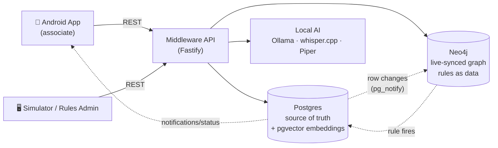
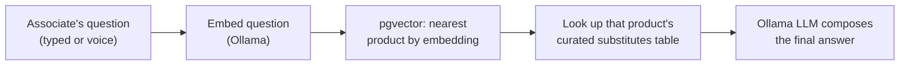

# BOPIS Store Associate App — SAP Interview Demo

Buy-Online-Pick-Up-In-Store demo for store associates. Postgres is the single
source of truth; Neo4j is a live-synced reasoning layer that fires
data-driven rules (business logic as data, not code). Everything runs
locally via the command line — no Docker, no external accounts/API keys.

**Not for production** — built to demonstrate an engineering approach for a
technical interview.

## Mock SAP mapping (transparency)

| Mock in this repo | Stands in for (potential real system) |
|---|---|
| `stores` / `shelves` seed data | SAP S/4HANA Site / Store Master |
| `products` seed data | SAP Material Master |
| `inventory` | SAP Available-To-Promise (ATP) / Inventory Management |
| `customers` seed data | SAP Customer Data Cloud (CDC) / Customer Profile |
| `orders` / `order_items` | SAP S/4HANA Sales Order Management |

## Architecture at a glance

- **Postgres 16 + pgvector** — system of record + embeddings for similarity search.
- **Neo4j Community** — live-mirrored knowledge graph; rules stored as data (`rules` table), evaluated via Cypher.
- **Node.js + TypeScript (Fastify)** — middleware API, sync engine, rule engine.
- **Ollama** — local LLM + embeddings (no API key, no cloud account).
- **whisper.cpp** — local speech-to-text.
- **Piper** — local text-to-speech.
- **Android (Kotlin/Compose)** — offline-first store associate app (QR scan → pick/report shelf,
  Orders/OrderDetail, Notifications, voice Assistant), runs in the emulator or a Pixel 6a.
- **Two small web UIs** — Customer Order Simulator (`/simulator.html`) and Rules Admin
  (`/rules.html`), served directly by Fastify as static HTML/vanilla JS (no build step, no
  separate customer app — the shared basis is the database).

### How it fits together (simple view)



Postgres is the only place data is ever written first; Neo4j and the AI layer only
*read* from it or write back derived results (notifications, substitutions) — never
the other way around.

### Where the vector DB (pgvector) fits in

The vector DB's job is narrow and easy to reason about: it only answers **"which
product is the associate asking about?"** — it never decides what counts as a
valid substitute.



1. The question text is embedded (same Ollama model used to embed every product's
   name/description at seed time).
2. pgvector's `<=>` distance operator finds the single closest-matching `products` row —
   this is the *only* thing vector search decides.
3. That product's real substitutes come from the curated `substitutes` table (not
   vector search) — if there are none, the LLM is explicitly told not to invent one.
4. The LLM only formats the final sentence from that structured, already-correct context.

See [docs/architecture.md](docs/architecture.md) for the full sequence diagram of the
graph-sync/rule-firing loop and the production-replacement mapping (for interview slides),
and [docs/data-model.md](docs/data-model.md) / [docs/api.md](docs/api.md) for
the data model and API contract.

## Prerequisites (macOS, Homebrew, no Docker)

```bash
brew install postgresql@17 pgvector neo4j ollama whisper-cpp node
brew services start postgresql@17
ollama serve &
ollama pull llama3.2
ollama pull nomic-embed-text
neo4j start
```

For the Android app you additionally need a JDK 17+, the Android command-line
tools, and Gradle — see [Android setup](#android-setup-emulator--build) below.

pgvector's Homebrew bottle is built against PostgreSQL 17/18 — use `postgresql@17`,
not `@16` (the extension `.control` file won't be found otherwise).

Piper TTS: the Homebrew formula is unreliable; install via pip instead and
download a voice model once:

```bash
python3 -m pip install piper-tts
python3 -m piper.download_voices --download-dir backend/models en_US-lessac-medium
```

## Setup (first time only)

```bash
cd backend
cp .env.example .env   # then set PGUSER to $(whoami) and clear PGPASSWORD (Homebrew Postgres uses trust auth)
npm install
```

Neo4j requires a one-time password change on first login, matching whatever you put in
`.env` as `NEO4J_PASSWORD` — this must happen before the very first `neo4j start`:

```bash
neo4j stop
neo4j-admin dbms set-initial-password <your-password>
neo4j start
```

## Start the demo

### Option A — one overall command (services → clean data → backend → emulator → app)

```bash
scripts/start-demo.sh
```

Starts Postgres/Neo4j/Ollama if not already running, resets the DB and graph to a clean
state (`demo:reset`), starts the backend, boots the emulator if needed, then builds,
installs and launches the Android app. Safe to re-run any time you want to go back to a
clean/empty state. Add `SKIP_ANDROID=1` to only reset data and start the backend, e.g. if
the emulator/app are already up and you just want fresh data:

```bash
SKIP_ANDROID=1 scripts/start-demo.sh
```

### Option B — individual commands (if you only need to redo one part)

```bash
cd backend
npm run demo:reset   # drops+recreates the DB, re-applies schema, seeds master data +
                      # rules (NOT orders), wipes and rebuilds the Neo4j graph
nohup npm run dev < /dev/null > /tmp/backend.log 2>&1 & disown
curl localhost:3000/health   # {"status":"ok"}
```

(the Android emulator boot / build / install commands are unchanged — see
[Android setup](#android-setup-emulator--build) below.)

## Stop the demo

`start-demo.sh` deliberately starts the backend/emulator with `nohup ... & disown` so they
survive the terminal being closed (needed to avoid a `SIGTTIN`-suspend bug — see
Troubleshooting) — which also means closing the terminal does **not** stop them. Use:

```bash
scripts/stop-demo.sh          # stops the backend + emulator
FULL=1 scripts/stop-demo.sh   # also stops Postgres/Neo4j/Ollama
```

After `demo:reset`, `rules`/`products`/`stores`/`shelves`/`inventory`/`customers` are
pre-seeded (mock SAP master data — see the mapping table above) but **`orders` is
empty on purpose**, so the Customer Order Simulator → Android app flow can be shown
live from scratch. If you want one pre-existing order for quick manual testing instead,
also run `npm run seed:demo-order`.

Backend must always be started with stdin redirected from `/dev/null`, otherwise
`tsx watch`'s stdin-keypress listener can get the process suspended (`SIGTTIN`)
the moment it's backgrounded — it looks like a hang (TCP connects, never
responds) but is actually a stopped process:

```bash
nohup npm run dev < /dev/null > /tmp/backend.log 2>&1 & disown
```

Once running, open in a browser:

- `http://localhost:3000/` — landing page linking to both admin UIs
- `http://localhost:3000/rules.html` — **Rules Admin**: view/enable-disable/create rules
  (business logic as data — no redeploy needed to change behaviour)
- `http://localhost:3000/simulator.html` — **Customer Order Simulator**: create a customer
  order (there is no separate customer-facing app; the database is the shared basis)
- `http://localhost:7474` — Neo4j Browser (the live reasoning/knowledge-graph layer)

## Android setup (emulator + build)

```bash
brew install --cask android-commandlinetools temurin17
brew install gradle
export JAVA_HOME=/opt/homebrew/opt/openjdk@25   # or your JDK 17+ install
SDK_ROOT=/opt/homebrew/share/android-commandlinetools

# install a stable platform + system image (avoid the bleeding-edge preview
# platform Android Studio's first-run wizard may pull, which newer AGP can't parse)
sdkmanager --sdk_root="$SDK_ROOT" "platforms;android-35" \
  "system-images;android-35;google_apis;arm64-v8a"

# create the AVD (answer "no" to the custom hardware-profile prompt; --device
# throws a bogus devices.xml error on this tool version)
echo no | avdmanager create avd -n bopis_demo \
  -k "system-images;android-35;google_apis;arm64-v8a" --sdk_root="$SDK_ROOT"

# boot the emulator, detached so it survives the terminal
nohup ~/Library/Android/sdk/emulator/emulator -avd bopis_demo \
  -no-boot-anim -no-snapshot > /tmp/emulator.log 2>&1 & disown

# build + install + launch the app (from android/)
cd android
gradle assembleDebug
~/Library/Android/sdk/platform-tools/adb install -r app/build/outputs/apk/debug/app-debug.apk
~/Library/Android/sdk/platform-tools/adb shell am start -n com.bopis.associate/.MainActivity
```

The emulator reaches the host's backend at `10.0.2.2:3000` automatically —
no extra networking config needed. A real Pixel 6a works the same way over
USB debugging, except the app's base URL must point at the Mac's LAN IP
instead of `10.0.2.2`.

## Demo script (what to have open, and in what order)

For a live Teams call, open everything **before** the call starts so nothing
needs to load on camera, and keep it all visible/switchable via
Cmd+Tab / browser tabs throughout — the point of the demo is to show the data
flowing between screens, not to narrate slides:

1. **Android emulator window** — app open on the Orders screen.
2. **Browser tab** — `/simulator.html` (Customer Order Simulator).
3. **Browser tab** — `/rules.html` (Rules Admin).
4. **Browser tab** — Neo4j Browser (`localhost:7474`), with a Cypher query like
   `MATCH (n)-[r]->(m) RETURN n, r, m LIMIT 100` ready to re-run to show the live graph
   (a plain `MATCH (n) RETURN n` only returns bare nodes with no relationship lines).
5. **Terminal** — `tail -f /tmp/backend.log` visible in a corner, so rule firings
   and sync requests scroll live as you interact with the app.

### Concrete walkthrough (exact customers/products — copy this 1:1)

The Android app is hardcoded to one store (`Constants.STORE_ID` = **Downtown
Supermarket**), so every order below must be placed against that store. The
cast is deliberately small so two orders exercise all 4 rules:

| Seed entity | Value | Why this one |
|---|---|---|
| Customer A | **Alice Johnson** | `alternative_ok_if_empty = true` — the one customer who *will* get a substitute suggestion. Also `last_order_at` is already >60 days ago, for the loyalty rule (see step 5). |
| Customer B | **Bob Smith** | `alternative_ok_if_empty = false` — negative-case contrast for the same substitute rule. |
| Product A | **Whole Milk 1L** (`QR-ST01-MILK`) | Has a curated substitute (Oat Milk 1L) *and* is stocked at both stores — one shelf report on this item fires 3 of the 4 rules at once. |
| Product B | **White Bread Loaf** (`QR-ST01-BREAD`) | Also has a curated substitute (Whole Grain Bread Loaf) and is stocked at both stores — used with Bob to prove the substitute rule is properly gated by opt-in even though a substitute *does* exist. |
| Store to compare against | **Uptown Supermarket** | Stocks Milk and Bread too, so cross-store availability has real data to find. |

Run `demo:reset` first so `rule_firings`/notifications start empty. Then:

1. **Order 1 — the "hero" order.** In the Simulator: Customer = **Alice Johnson**,
   Store = **Downtown Supermarket**, Product = **Whole Milk 1L** only. Submit.
2. Android app → **Refresh** on Orders → open Alice's order → **Pick shelf (no camera)**
   → **Whole Milk 1L** → tap **Is Empty**.
   This single tap fires 3 rules simultaneously — narrate each as it appears:
   - **On the same screen**: "Suggested substitute (customer opted in): Oat Milk 1L" —
     `suggest_substitute_on_empty` (gated on Alice's opt-in).
   - **Notifications tab**: an `available_at_other_store` notification naming
     **Uptown Supermarket** and its remaining qty — `suggest_other_store_on_empty`
     (note: this one is *not* gated by opt-in — it fires for any customer, since telling
     an associate where else stock exists doesn't need customer consent).
   - **Notifications tab**: a `shelf_low_stock` manager notification for Whole Milk 1L —
     `notify_manager_on_low_stock`.
   - Flip to `tail -f /tmp/backend.log` to show all 3 firing in real time, then to
     Neo4j Browser to show the `Product -[:SUBSTITUTE_FOR]-> Product` /
     `Shelf -[:LOCATED_IN]-> Store` pattern each one matched against.
3. **Order 2 — the contrast order.** In the Simulator: Customer = **Bob Smith**,
   Store = **Downtown Supermarket**, Product = **White Bread Loaf** only. Submit,
   refresh, open the order, pick the Bread shelf, tap **Is Empty**.
   - The screen shows **"No substitute available or customer opted out."** even though
     Whole Grain Bread Loaf *is* a real curated substitute — proves the gate is
     evaluated per-customer, not per-product.
   - The manager low-stock and cross-store-availability notifications still fire (same
     as step 2) — reinforcing that those two rules don't care about customer opt-in.
4. **Rules Admin, live behaviour change.** Disable `suggest_substitute_on_empty`, place a
   fresh order for Alice on a still-`ok` shelf (e.g. Coffee Beans doesn't have a
   substitute — use Milk again after resetting it to `ok`), tap **Is Empty** again, and
   show no substitute suggestion appears this time — same code path, rule disabled as
   pure data, zero redeploy.
5. **Loyalty rule (the one rule with no live UI trigger).** `loyalty_addon_suggestion`
   fires on `customers` row changes — nothing in the UI updates a customer row live today
   (in production this would be a nightly dormant-customer batch job, not a user action).
   Trigger it manually right before switching to Notifications:
   ```bash
   psql -h localhost -U "$(whoami)" -d bopis -c \
     "UPDATE customers SET updated_at = now() WHERE id = 'c1000000-0000-0000-0000-000000000001';"
   ```
   Alice's `last_order_at` is already >60 days old, so this fires a `loyalty_addon`
   notification suggesting the associate add a free Dark Chocolate Bar to her pickup.
6. **Assistant tab (voice).** Tap record, ask **"is there a similar product to whole
   milk?"** — callback to the same hero product from step 2. Shows: whisper.cpp
   transcript → pgvector nearest-product match (Whole Milk 1L) → curated substitutes
   lookup (Oat Milk 1L) → Ollama composes the sentence → Piper speaks it back, fully
   offline. See [docs/architecture.md](docs/architecture.md#where-pgvector-is-actually-used-query-time-mapping)
   for the full request-mapping diagram.

## Status

- [x] Phase 1 — Data model, mock-SAP seeds, Neo4j constraints
- [x] Phase 2 — Middleware core API (orders, shelves, sync, rules, customer-orders)
- [x] Phase 3 — Android core loop app (Orders, OrderDetail, shelf QR-scan actions, Notifications)
- [x] Phase 4 — Live Postgres → Neo4j sync + data-driven rule engine
- [x] Phase 5 — Offline-first bidirectional sync (Room + WorkManager outbox/pull)
- [x] Phase 6a — Local AI building blocks (embeddings, LLM, STT, TTS) wired end-to-end
      (voice Assistant screen: record → whisper.cpp → RAG over Neo4j/pgvector → Ollama → reply)
- [x] Phase 6b — Rules Admin UI + Customer Order Simulator UI
- [x] Phase 7 — Demo polish & docs (this README)

## Known simplifications (call these out explicitly in the interview)

- One shelf = exactly one product slot (keeps the QR-scan flow trivial).
- `/sync/push` currently logs entries to `sync_outbox` for audit/idempotency;
  applying arbitrary entity payloads generically is a Phase 5 follow-up —
  today, writes go through the dedicated REST routes (`pick`, `substitute`, `report`).
- Conflict resolution is last-write-wins via a global logical clock
  (`global_version_seq`); production would evaluate CRDT-based engines
  (see [docs/architecture.md](docs/architecture.md)).
- The Orders screen has no pull-to-refresh/auto-refresh — tap the explicit **Refresh**
  button in the top bar after creating an order elsewhere (e.g. the simulator).
- The Android emulator's back camera has no usable feed for real QR scanning (it renders a
  synthetic test pattern, not a live image) — use **Pick shelf (no camera)** on the
  emulator instead, which lists the same shelves without needing the camera. **Scan shelf**
  itself is unchanged and works as expected on a real device (e.g. the Pixel 6a).

## Troubleshooting

- **Backend seems to "hang" (connects, never responds) right after backgrounding it**:
  it's almost certainly suspended (`SIGTTIN`), not crashed — check with
  `ps -o pid,stat,command -p <pid>` (`STAT=T` means stopped). Always start it with
  `< /dev/null` redirected (see [Setup](#setup)).
- **`@fastify/static` crashes on boot with `FST_ERR_PLUGIN_VERSION_MISMATCH`**: this repo
  pins Fastify 4.x — install `@fastify/static@6`, not the latest major (v8, which needs
  Fastify 5).
- **`inventory.status` check constraint violation**: only `'ok' | 'low' | 'empty'` are valid;
  the app's "Is Nearly Empty" button sends `"low"`.
- **`avdmanager create avd --device ...` errors on `devices.xml`**: omit `--device` entirely.
