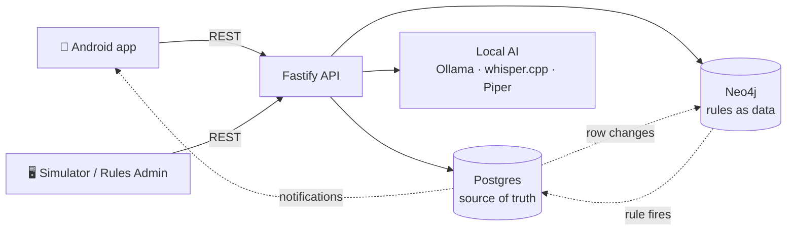
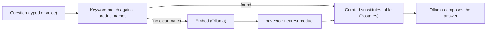

# BOPIS Store Associate App

Buy-Online-Pick-Up-In-Store demo for store associates. Runs fully locally —
no Docker, no cloud accounts, no API keys.

**Not for production.** This is a demo built to show an engineering approach,
not a hardened system.

## The core idea: data-centric architecture

Postgres is the single source of truth. Every other layer reads from it,
derives something, and writes results back — nothing bypasses it.

This has one big payoff: **business logic lives in data, not code.**
Rules are rows in a `rules` table, each with a Cypher query and an action.
The rule engine just evaluates whatever rows exist. Adding, editing, or
disabling behaviour is a data change (via [rules.html](http://localhost:3000/rules.html)),
not a deploy.



## Business logic in rules

A rule is one Postgres row: a name, a trigger table, a Cypher query against
the Neo4j mirror, and an action (e.g. "notify manager", "suggest substitute").
The engine watches Postgres for changes, runs any matching rule's Cypher
query, and fires the action if it returns results.

Four rules ship in [db/seed_rules.sql](db/seed_rules.sql):

| Rule | Fires when | Action |
|---|---|---|
| `notify_manager_on_low_stock` | A shelf goes empty | Notify the manager |
| `suggest_substitute_on_empty` | A shelf goes empty, customer opted in | Suggest a substitute product |
| `suggest_other_store_on_empty` | A shelf goes empty | Suggest a nearby store with stock |
| `loyalty_addon_suggestion` | A dormant customer orders again | Suggest a loyalty add-on |

Edit or disable any of these live in [rules.html](http://localhost:3000/rules.html) —
no redeploy, no code change.

Two more notification types are sent directly by the app, not the rule
engine: picking an order item sends the customer a "ready to collect your
order" message, and answering "Yes" to the proactive agent's substitute/other-store
prompt records what the customer agreed to. Both show up in the Android app's
Alerts → Sent tab alongside manager notifications.

## Where AI comes in

| Capability | Technology | Runs where | Used for |
|---|---|---|---|
| LLM (chat/answers) | Ollama (`llama3.2`) | Local, on the Mac | Composing the assistant's spoken/typed answers |
| Embeddings | Ollama (`nomic-embed-text`) | Local, on the Mac | Turning a question into a vector for similarity search |
| Vector search | pgvector (Postgres extension) | Local, in Postgres | Fallback for finding which product a free-text question is about, when no product name is clearly present in the question (see below) |
| Speech-to-text | whisper.cpp | Local, on the Mac | Transcribing the associate's voice question |
| Text-to-speech | Piper | Local, on the Mac | Speaking the assistant's answer back, incl. proactive prompts |
| Proactive suggestions | Rule engine + Cypher (no LLM) | Local, in Neo4j | Deciding *what* to suggest — deterministic, not model-guessed |

No cloud AI service is used anywhere — everything above runs on the same
machine as the backend. This keeps the demo offline and free, and mirrors how
a production deployment could keep sensitive retail data in-house.

The vector DB's job is narrow on purpose: it only answers *"which product is
the associate asking about?"*, and only as a fallback — catalog names are
short and near-duplicates (e.g. "Whole Milk 1L" vs "Oat Milk 1L"), so a
question is matched against product names directly first; embeddings only
run when no product name is clearly present in the question. It never
decides what a valid substitute is. Substitutes are always curated data (the
`substitutes` table in Postgres), read through one of two paths depending on
which feature is asking:

- **Chat assistant** queries the `substitutes` table in Postgres directly.
- **Proactive agent / shelf-empty rule** queries the same data through its
  Neo4j mirror — the `suggest_substitute_on_empty` rule matches the
  `(:Product)-[:SUBSTITUTE_FOR]->(:Product)` relationship, which is just the
  `substitutes` table synced into graph form.

Either way, the LLM never invents a substitute — it only phrases one that a
query already found.



The same idea applies to the proactive agent: the *decision* to suggest
something is a rule (deterministic, auditable, sourced from the same
`substitutes` table via Neo4j), the *voice* is just Piper reading out the
resulting text.

## Why each technology was chosen

| Technology | Why | Production-scalability angle |
|---|---|---|
| Postgres + pgvector | Mature, transactional, one engine for relational data and vector search | Managed Postgres scales vertically/read-replicas; avoids running a separate vector DB |
| Neo4j | Rule conditions are graph patterns (e.g. "product's substitute, same store") — Cypher expresses this far more simply than SQL joins | Neo4j clusters horizontally for read-heavy graph queries; the graph stays a derived cache, so it can be rebuilt or resized without risking the source of truth |
| Fastify (Node/TypeScript) | Low-overhead, fast to iterate, good TypeScript support | Stateless HTTP layer — scales horizontally behind a load balancer |
| Ollama | Local LLM/embeddings with zero API cost/key management for a demo | Swappable for a hosted LLM endpoint behind the same interface in production |
| whisper.cpp / Piper | Local, no per-request cost, fully offline | Same interface could point at a managed STT/TTS service if latency/scale demands it |
| Android + Kotlin/Compose | Native performance, offline-first storage (Room), modern declarative UI | Store associates need a real device app, not a mobile web view, for camera/QR access |
| Data-centric + rules-as-data | Keeps business logic changeable without redeploying the app or backend | Rule rows are simple to review, test, and roll back — much cheaper to govern than code changes at scale |

## Bidirectional sync, offline-first, idempotent

The Android app works offline and syncs both ways:

- **Push (device → server):** actions (pick item, report shelf empty, etc.)
  are queued in a local Room outbox and sent when connectivity returns.
  Each entry carries a client-generated ID, so retries are **idempotent** —
  sending the same entry twice has no extra effect.
- **Pull (server → device):** the app polls `/sync/pull?since=<version>` and
  only gets rows changed after that version. A global logical clock
  (`global_version_seq`) makes this cheap and exact — no timestamps to
  reconcile, no missed rows.
- **Conflict handling:** last-write-wins by version number. Simple, and
  enough for this demo's write patterns (a shelf or order item is normally
  only touched by one associate at a time).

This means the app keeps working with no signal (e.g. a stockroom with poor
Wi-Fi), and reconnecting never double-applies an action or loses one.

This outbox/pull sync layer is hand-rolled here to keep the demo
dependency-free — it is **not** what you'd run in production. Replace it with
a dedicated sync product: SAP Mobile Services (Offline OData Sync) if you're
already on SAP BTP, or an OSS alternative like PowerSync/ElectricSQL
otherwise. Both handle schema evolution, larger conflict classes, and device
fleet management that this demo doesn't attempt.

## Mock SAP mapping

| Mock in this repo | Stands in for |
|---|---|
| `stores` / `shelves` | SAP S/4HANA Site / Store Master |
| `products` | SAP Material Master |
| `inventory` | SAP Available-To-Promise (ATP) |
| `customers` | SAP Customer Data Cloud (CDC) |
| `orders` / `order_items` | SAP S/4HANA Sales Order Management |

See [docs/architecture.md](docs/architecture.md) for the full sequence
diagram and production-replacement mapping, and
[docs/data-model.md](docs/data-model.md) / [docs/api.md](docs/api.md) for the
data model and API contract.

## Prerequisites (macOS, Homebrew)

```bash
brew install postgresql@17 pgvector neo4j ollama whisper-cpp node gradle scrcpy
brew install --cask android-commandlinetools temurin17
brew services start postgresql@17
ollama serve &
ollama pull llama3.2
ollama pull nomic-embed-text
neo4j start
python3 -m pip install piper-tts
python3 -m piper.download_voices --download-dir backend/models en_US-lessac-medium
```

Use `postgresql@17`, not `@16` — the Homebrew pgvector bottle needs it.

## First-time setup

```bash
cd backend
cp .env.example .env   # set PGUSER to $(whoami), clear PGPASSWORD (Homebrew Postgres uses trust auth)
npm install

neo4j stop
neo4j-admin dbms set-initial-password <your-password>   # must match NEO4J_PASSWORD in .env
neo4j start
```

## Running the demo

```bash
scripts/start-demo.sh                  # services, clean data, backend, + any attached physical device (mirrored via scrcpy)
scripts/start-demo.sh --emulator       # same, and also boots/installs on the emulator
SKIP_ANDROID=1 scripts/start-demo.sh   # just reset data + start the backend
scripts/stop-demo.sh               # stop backend + emulator
FULL=1 scripts/stop-demo.sh        # also stop Postgres/Neo4j/Ollama
```

`start-demo.sh` is safe to re-run — it always resets to a clean state
(master data seeded, `orders` empty).

Once running, open:

- `http://localhost:3000/` — admin landing page
- `http://localhost:3000/rules.html` — Rules Admin
- `http://localhost:3000/simulator.html` — Customer Order Simulator (there is
  no separate customer-facing app; this simulates one placing an order)
- `http://localhost:3000/qrcodes.html` — printable shelf QR codes
- `http://localhost:7474` — Neo4j Browser

The Android app has no separate Assistant tab — tap the 🤖 bubble in the
bottom-right corner any time to open the chat window (type or record), and
when a rule fires a navigation suggestion, the same assistant speaks it.

If a physical phone is attached, `start-demo.sh` also mirrors its screen to a
window on this Mac via `scrcpy` (installed above) — handy when screen-sharing
this Mac, since a real device otherwise has no window of its own the way the
emulator does.

## Known simplifications

- One shelf = exactly one product slot.
- Conflict resolution is last-write-wins, not CRDT-based — fine for this
  demo's write patterns, not for high-contention production use.
- The Android emulator's back camera renders a synthetic test pattern, not a
  live feed — use **Pick shelf (no camera)** there. **Scan shelf** works as
  expected on a real device.

## Troubleshooting

- **Backend seems to hang right after backgrounding it**: it's likely
  suspended (`SIGTTIN`), not crashed. Always start it with `< /dev/null`
  redirected, e.g. `nohup npm run dev < /dev/null > /tmp/backend.log 2>&1 & disown`.
- **`@fastify/static` fails to boot**: this repo pins Fastify 4.x — use
  `@fastify/static@6`, not v8 (needs Fastify 5).
- **`inventory.status` constraint violation**: only `'ok' | 'low' | 'empty'`
  are valid.
- **`avdmanager create avd --device ...` errors on `devices.xml`**: omit
  `--device` entirely.

