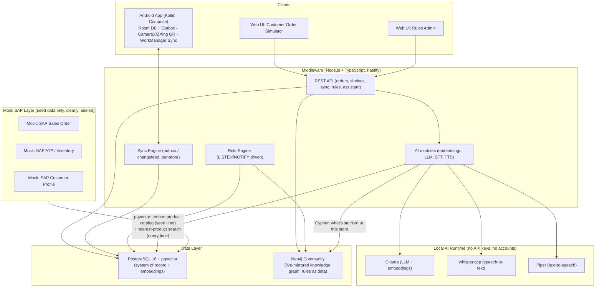
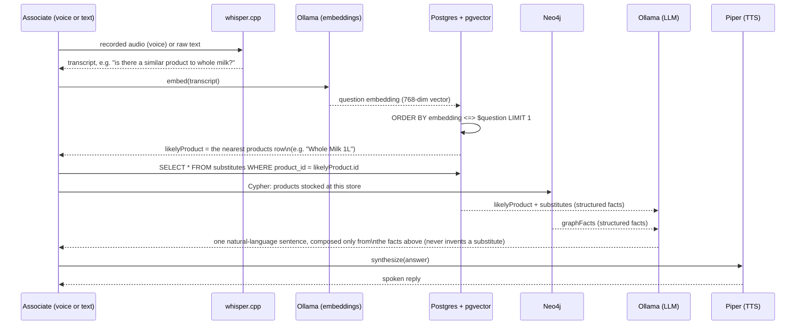
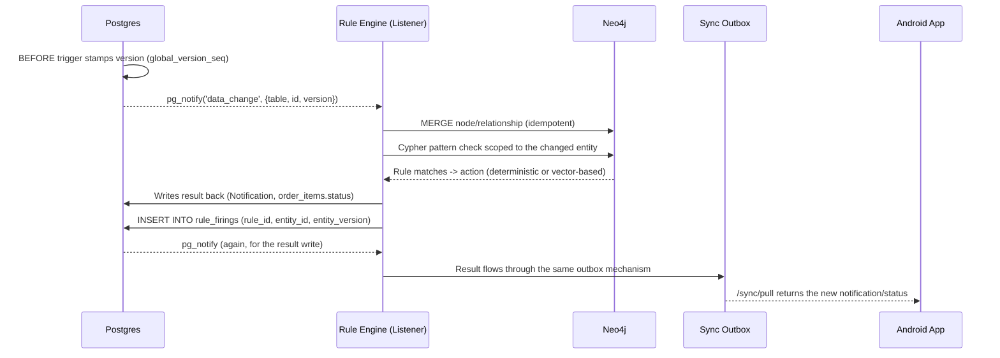

# Architecture

## System overview

## Where pgvector is actually used (query-time mapping)

The vector index only ever answers one question: **which single `products` row is
this free-text question about?** It never decides rule outcomes or substitute
validity — those stay in normal SQL/Cypher lookups against curated data.

So a text/voice utterance is never mapped to an "intent" or a "rule" — it is
mapped to **exactly one row in the `products` table**, chosen by nearest-neighbor
distance between the question's embedding and that product's stored embedding.
Everything downstream (substitutes, stock-at-this-store) is a plain lookup keyed
off that one product id; the LLM only turns already-decided facts into a sentence.

## Live graph sync & rule-firing loop

Postgres stays the single source of truth. Neo4j is only ever written to via
idempotent `MERGE`, driven by Postgres change events — it never originates data.

`rule_firings` (unique on `rule_id, entity_id, entity_version`) makes rule
evaluation idempotent — replaying the same change event never fires twice.

## Why rules run against Neo4j and not directly against Postgres

Honest answer: the 4 rules seeded in this demo are simple enough that they
*could* be plain SQL against Postgres directly — nothing here strictly requires
a graph database. Neo4j is used anyway, deliberately, for three reasons:

1. **The pattern needs to survive rule growth, not just today's 4 rules.**
   `suggest_substitute_on_empty` already chains 3 relationship hops
   (`OrderItem → Product → Shelf`, `OrderItem → Customer`,
   `Product -[:SUBSTITUTE_FOR]-> Product`) in one readable Cypher pattern.
   Real substitute/recommendation logic tends to grow into *variable-length*
   traversals ("find a substitute of a substitute", "what do similar customers
   buy instead") — trivial to add a hop to in Cypher, increasingly painful as
   nested joins/recursive CTEs in SQL.
2. **Separation of write path from reasoning path.** Postgres stays the only
   place anything is ever written first (see diagram above) — Neo4j is a
   disposable, rebuildable *read-side* projection. That means rule evaluation
   (arbitrary Cypher, potentially expensive graph traversal) never competes
   with or risks the transactional write path; you can wipe and rebuild the
   whole graph from Postgres at any time with zero data loss.
3. **It's the direct analogue of a real SAP capability.** This maps 1:1 to
   HANA's Graph Engine sitting alongside its relational tables in the same
   database — the interview point isn't "Neo4j is required," it's "business
   rules expressed as graph patterns over live-synced data, stored as data
   (the `rules` table) instead of hardcoded `if` statements, so a rule change
   is a Rules Admin edit, not a redeploy."

If asked directly: *"for exactly these 4 rules, SQL would work fine — Neo4j
earns its place once relationship depth/variability grows, and as a clean
separation between transactional writes and read-side reasoning."*

## Production-replacement mapping (for interview slides)

| Demo component (now) | OSS production alternative | SAP / enterprise alternative |
|---|---|---|
| pgvector | Qdrant / Milvus / Weaviate | SAP HANA Cloud Vector Engine |
| Neo4j Community | Neo4j Cluster / Aura | SAP HANA Graph Engine |
| Custom outbox sync | ElectricSQL, PowerSync | SAP Mobile Services (Offline OData Sync) |
| `pg_notify`/`LISTEN` as event bus | Kafka, NATS, Redpanda | SAP Event Mesh |
| Ollama (local LLM) | vLLM / TGI behind a load balancer | SAP AI Core / Generative AI Hub |
| Node.js single-process backend | Horizontally replicated stateless API behind a load balancer | SAP BTP (Cloud Foundry / Kyma) |

## Scalability notes (not implemented, talking points only)

- API is stateless → horizontally replicable.
- Sync is partitioned per `store_id` → no single-writer bottleneck.
- Rule evaluation is scoped to the changed entity's local Cypher pattern, not a full-graph scan.
- AI modules are decoupled from the transactional API path, so heavy inference doesn't block writes.
