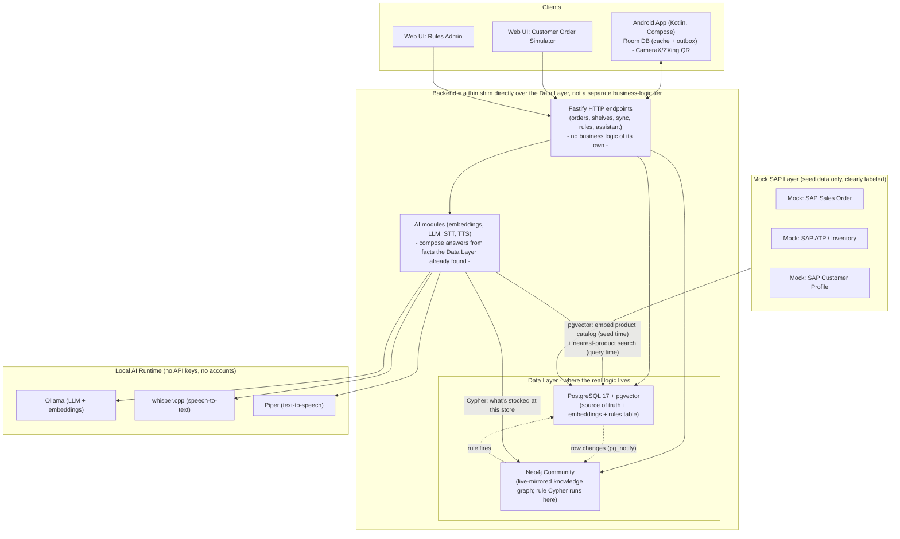
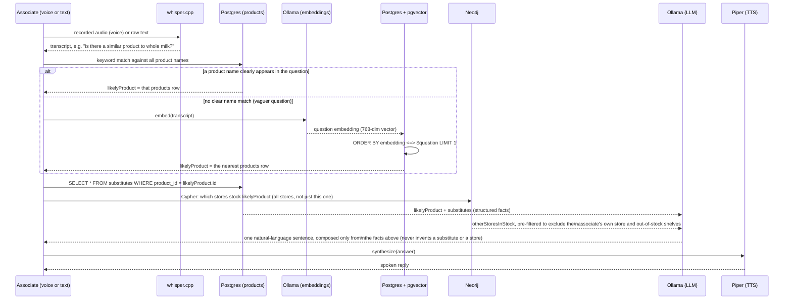
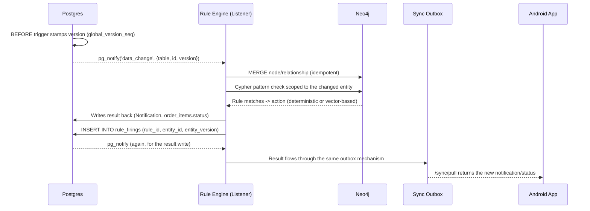

# Architecture

## System overview

The "Middleware" is deliberately not drawn as its own business-logic tier: the
Fastify endpoints, sync push/pull, and rule listener are thin code that reads
and writes the Data Layer — they don't hold decision logic themselves. The
actual logic (what counts as low stock, what's a valid substitute, when to
notify) lives as **data** inside Postgres/Neo4j (the `rules` table + its
Cypher), so the backend process can be redeployed, scaled, or replaced without
touching business behaviour.

## Where pgvector is actually used (query-time mapping)

The vector index only ever answers one question: **which single `products` row is
this free-text question about?** It never decides rule outcomes or substitute
validity — those stay in normal SQL/Cypher lookups against curated data.

Matching is keyword-first, embeddings as fallback: catalog names are short and
near-duplicates (e.g. "Whole Milk 1L" vs "Oat Milk 1L"), which the embedding of
a *full question sentence* doesn't reliably tell apart — that mismatch used to
make "alternative to whole milk?" resolve to Oat Milk 1L (no substitute of its
own), so the answer was always "no known alternative". A question is now
checked against product names directly first (majority of a name's words must
appear in the question); embeddings only run when no product name is clearly
present.

So a text/voice utterance is never mapped to an "intent" or a "rule" — it is
mapped to **exactly one row in the `products` table**, chosen by keyword match
first and nearest-neighbor embedding distance as a fallback. Everything
downstream (substitutes, cross-store stock) is a plain lookup keyed off that
one product id; the LLM only turns already-decided facts into a sentence — and
the "is it available elsewhere" filtering (excluding the current store and
empty shelves) is done in code, not left for the LLM to reason about, since a
small local model reasoned about that comparison unreliably.

## Two paths that answer similar-sounding questions

"Is there an alternative product?" and "is there another store that still has
it?" are each answered by **two different mechanisms**, not one — which one
runs depends on how the question arose, not on its wording:

| Question | Triggered by | Mechanism | Vector search? | LLM? | Code |
|---|---|---|---|---|---|
| Suggest a substitute | Associate reports an ordered item's shelf empty | Rule `suggest_substitute_on_empty`: pure Cypher match on `(:Product)-[:SUBSTITUTE_FOR]->(:Product)`, gated by `Customer.alternativeOkIfEmpty` | No | No | [engine.ts](../backend/src/rules/engine.ts) `runAction('suggest_substitute', ...)` |
| Is there another store with stock? | Same shelf-empty event | Rule `suggest_other_store_on_empty`: pure Cypher match across all stores | No | No | [engine.ts](../backend/src/rules/engine.ts) `runAction('suggest_other_store', ...)` |
| "Is there something similar to X?" / "is it available somewhere else?" (typed/spoken) | Associate asks the assistant a free-text question | RAG: keyword match (embeddings as fallback) → `substitutes` table + cross-store stock lookup → LLM phrases the answer | Yes (only as a fallback to find *which* product) | Yes (only to phrase the sentence) | [assistant.ts](../backend/src/routes/assistant.ts) `answerQuestion()` |

The first two rows are the ones behind the shelf-action screen's inline
suggestion and the proactive agent's Yes/No bubble — fully deterministic,
no model involved anywhere, retriggerable and auditable via `rule_firings`.

The third row is the only one that is actually RAG: retrieval (pgvector +
plain SQL/Cypher lookups) happens first and is never skipped, then the LLM
is handed only that retrieved data to phrase into a sentence — it cannot
answer from its own knowledge.

The assistant's free-text path also answers "is there another store with
this?" directly now: its Cypher looks up `likelyProduct`'s stock across *all*
stores, and the current store plus any empty shelves are filtered out before
the list ever reaches the LLM.

## Live graph sync & rule-firing loop

Postgres stays the single source of truth. Neo4j is only ever written to via
idempotent `MERGE`, driven by Postgres change events — it never originates data.

`rule_firings` (unique on `rule_id, entity_id, entity_version`) makes rule
evaluation idempotent — replaying the same change event never fires twice.

## Why rules run against Neo4j and not directly against Postgres

Honest answer: the 4 rules seeded in this demo are simple enough that they
*could* be plain SQL against Postgres directly — nothing here strictly requires
a graph database. Neo4j is used anyway, deliberately, for three reasons:

1. **The pattern needs to survive rule growth, not just today's 4 rules.**
   `suggest_substitute_on_empty` already chains 3 relationship hops
   (`OrderItem → Product → Shelf`, `OrderItem → Customer`,
   `Product -[:SUBSTITUTE_FOR]-> Product`) in one readable Cypher pattern.
   Real substitute/recommendation logic tends to grow into *variable-length*
   traversals ("find a substitute of a substitute", "what do similar customers
   buy instead") — trivial to add a hop to in Cypher, increasingly painful as
   nested joins/recursive CTEs in SQL.
2. **Separation of write path from reasoning path.** Postgres stays the only
   place anything is ever written first (see diagram above) — Neo4j is a
   disposable, rebuildable *read-side* projection. That means rule evaluation
   (arbitrary Cypher, potentially expensive graph traversal) never competes
   with or risks the transactional write path; you can wipe and rebuild the
   whole graph from Postgres at any time with zero data loss.
3. **It's the direct analogue of a real SAP capability.** This maps 1:1 to
   HANA's Graph Engine sitting alongside its relational tables in the same
   database. Neo4j isn't required for just 4 rules — the point is that
   business rules are expressed as graph patterns over live-synced data,
   stored as data (the `rules` table) instead of hardcoded `if` statements,
   so a rule change is a Rules Admin edit, not a redeploy.

For exactly these 4 rules, plain SQL would work fine — Neo4j earns its place
once relationship depth/variability grows, and as a clean separation between
transactional writes and read-side reasoning.

## Production-replacement mapping

| Demo component (now) | OSS production alternative | SAP / enterprise alternative |
|---|---|---|
| pgvector | Qdrant / Milvus / Weaviate | SAP HANA Cloud Vector Engine |
| Neo4j Community | Neo4j Cluster / Aura | SAP HANA Graph Engine |
| Custom outbox sync | ElectricSQL, PowerSync | SAP Mobile Services (Offline OData Sync) |
| `pg_notify`/`LISTEN` as event bus | Kafka, NATS, Redpanda | SAP Event Mesh |
| Ollama (local LLM) | vLLM / TGI behind a load balancer | SAP AI Core / Generative AI Hub |
| Node.js single-process backend | Horizontally replicated stateless API behind a load balancer | SAP BTP (Cloud Foundry / Kyma) |

## Scalability notes (not implemented, talking points only)

- API is stateless → horizontally replicable.
- Sync is partitioned per `store_id` → no single-writer bottleneck.
- Rule evaluation is scoped to the changed entity's local Cypher pattern, not a full-graph scan.
- AI modules are decoupled from the transactional API path, so heavy inference doesn't block writes.
