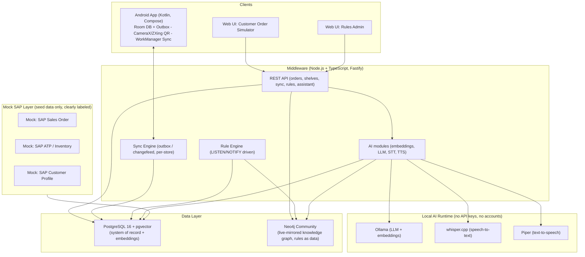
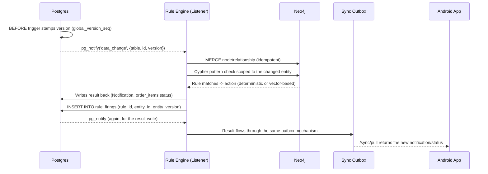

# Architecture

## System overview

## Live graph sync & rule-firing loop

Postgres stays the single source of truth. Neo4j is only ever written to via
idempotent `MERGE`, driven by Postgres change events — it never originates data.

`rule_firings` (unique on `rule_id, entity_id, entity_version`) makes rule
evaluation idempotent — replaying the same change event never fires twice.

## Production-replacement mapping (for interview slides)

| Demo component (now) | OSS production alternative | SAP / enterprise alternative |
|---|---|---|
| pgvector | Qdrant / Milvus / Weaviate | SAP HANA Cloud Vector Engine |
| Neo4j Community | Neo4j Cluster / Aura | SAP HANA Graph Engine |
| Custom outbox sync | ElectricSQL, PowerSync | SAP Mobile Services (Offline OData Sync) |
| `pg_notify`/`LISTEN` as event bus | Kafka, NATS, Redpanda | SAP Event Mesh |
| Ollama (local LLM) | vLLM / TGI behind a load balancer | SAP AI Core / Generative AI Hub |
| Node.js single-process backend | Horizontally replicated stateless API behind a load balancer | SAP BTP (Cloud Foundry / Kyma) |

## Scalability notes (not implemented, talking points only)

- API is stateless → horizontally replicable.
- Sync is partitioned per `store_id` → no single-writer bottleneck.
- Rule evaluation is scoped to the changed entity's local Cypher pattern, not a full-graph scan.
- AI modules are decoupled from the transactional API path, so heavy inference doesn't block writes.
